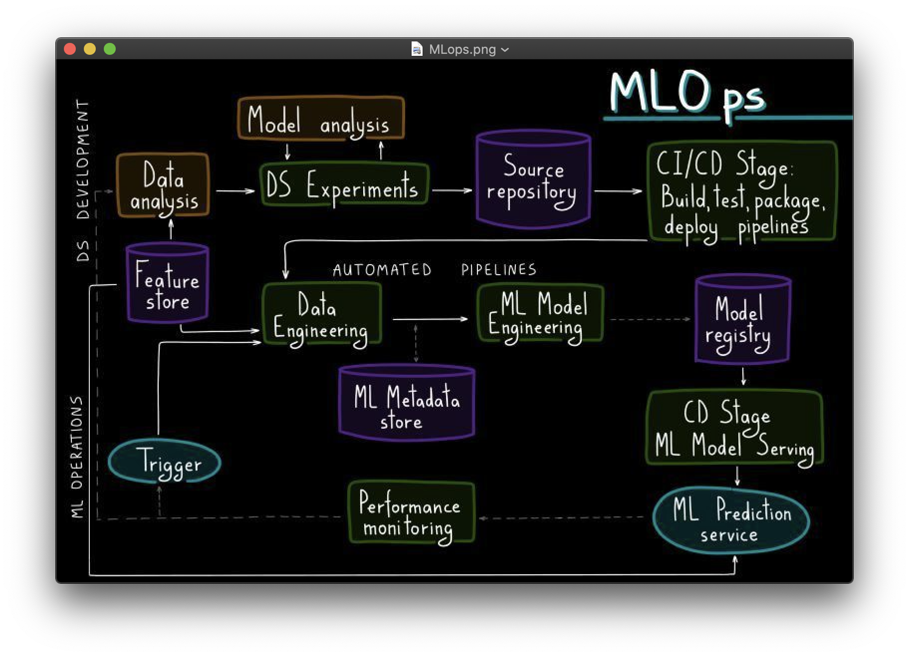
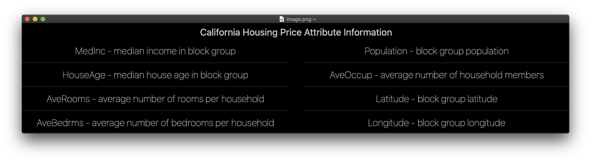
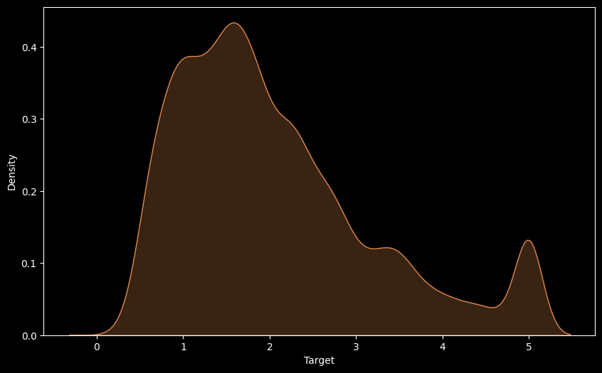
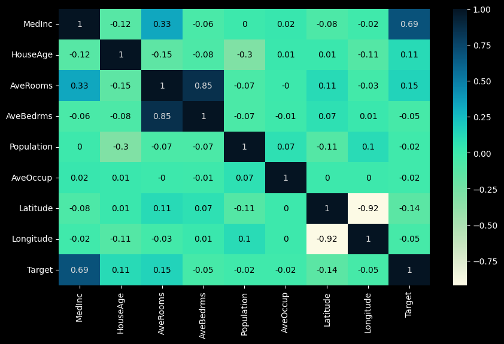
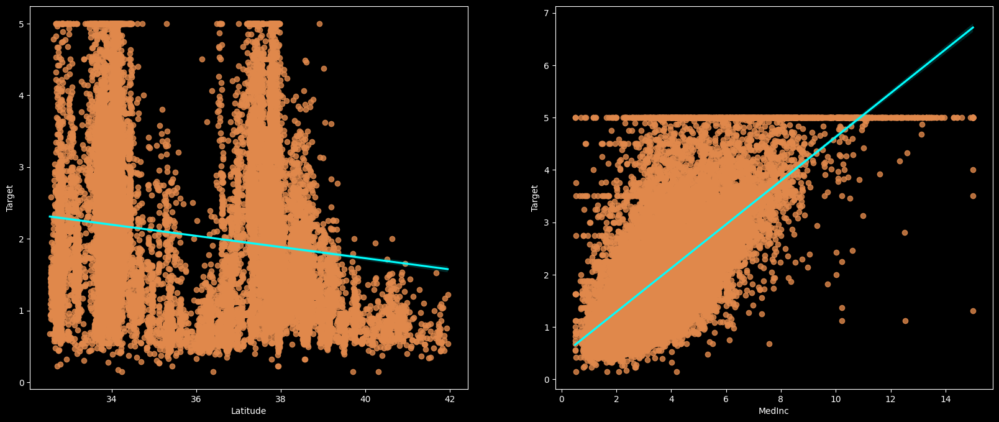
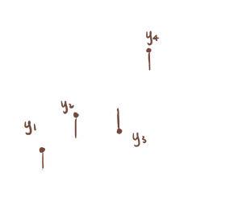
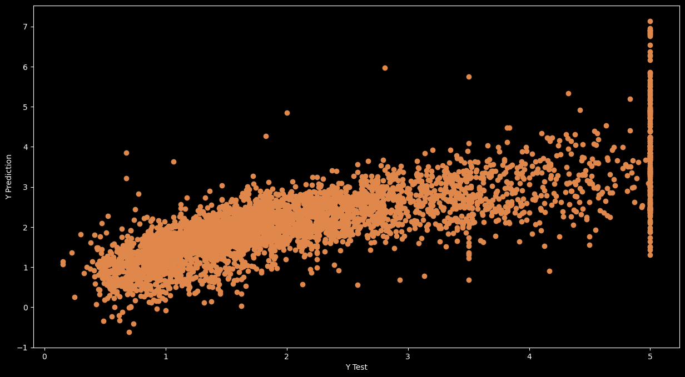
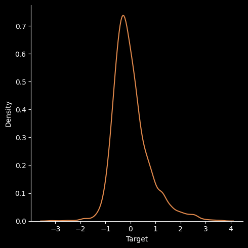
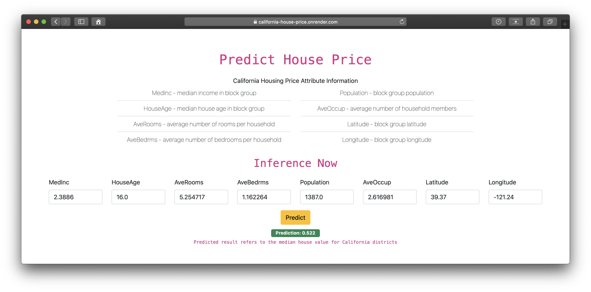

<h1 align="center">End to End House Price Prediction</h1>
<div align="center">

  	

   	 

       

</div>

<h2><a href="https://california-house-price.onrender.com/">⚠️ Live Here</a></h2>

## ML-OPS
MLOps, or DevOps for machine learning, enables data science and IT teams to collaborate and increase the pace of model development and deployment by monitoring, validation, and governance of machine learning models. 



Here, we're going to ecxplore more with real life prediction scenerios.

## Dataset Overview
### [California Housing](https://www.dcc.fc.up.pt/~ltorgo/Regression/cal_housing.html)
This dataset was derived from the 1990 United States Census, with one row for each census block group. The smallest geographic unit for which the U.S. Census Bureau releases sample data is a block group (a block group typically has a population of 600 to 3,000 people). A household is a collection of people who share a single residence. Since the average number of rooms and bedrooms in this dataset is given for each household, these columns may take very large values for block groups with few people and many vacant properties, such as resort communities.



The file contains all the the variables. Specifically, it contains median house value, median income, housing median age, total rooms, total bedrooms, population, households, latitude, and longitude in that order.

## Workflow

### Exploratory Data Analysis (EDA)

<code><b> 1. Univariate Target Density </b></code>

> 

<code><b> 2. Correlation Analysis </b></code>

Correlation analysis examines the linear correlation between variable pairs.

> 

Observations:
- To fit a linear regression model, we select those features which have a high correlation with our target variable 'Target'. By looking at the correlation matrix we can see that 'MedInc' has a strong positive correlation with 'Target' (0.69) where as 'Latitude' has a high negative correlation with 'Target'(-0.14).

- An important point in selecting features for a linear regression model is to check for multi-co-linearity. The features 'AveRooms', 'AveBedrms' have a correlation of 0.85. These feature pairs are strongly correlated to each other. We should not select both these features together for training the model. Same goes for the features 'Latitude' and 'Longitude' which have a correlation of -0.92.

<code><b> Target v/s Lattitude & Target v/s Medinc </b></code>

> 

### Data Preparation

- Splitting the data into training and testing sets.

- Normalization/Standard Scalling. 

- > <b>Note:</b>Why do we standardize data in Linear regression? Internally we use gradient descend algorithm, our main aim is to reach the global minima. To achieve that, we have to make sure that all our independent feature units should be on the same scale in order for convergence to happen.

### Model Overview 

Linear regression analysis is used to predict the value of a variable based on the value of another variable. The variable you want to predict is called the dependent variable. The variable you are using to predict the other variable's value is called the independent variable.



A simple linear regression, y = b0 + b1x, predicts relationship between one independent variable x and one dependent variable y, for instance, the classic height — weight correlation. As more features/independent variables are introduced, it evolves into multiple linear regression y = b0 + b1x1 + b2x2 + … + bnxn, which cannot be easily plotted using a line in a two dimensional space.

### Model Evaluation

Linear regression model can be qualitatively evaluated by visualizing error distribution. 

<code><b> Assumptions </b></code>



<code><b> Residuals </b></code>



## Deployment

> Configure Dockerfile

> Configure CI/CD Pipeline

End to End Live Machine Learning Regression Inference 



## Important Commands
To create a virtual environment 
```
conda create -p venv python==3.8 -y
```
To Activate Virtual Environment
```
. venv/bin/activate
```
To Deactivate VENV
```
conda deactivate
```
To Install Required Libraries
```
pip install -r requirements.txt
```
